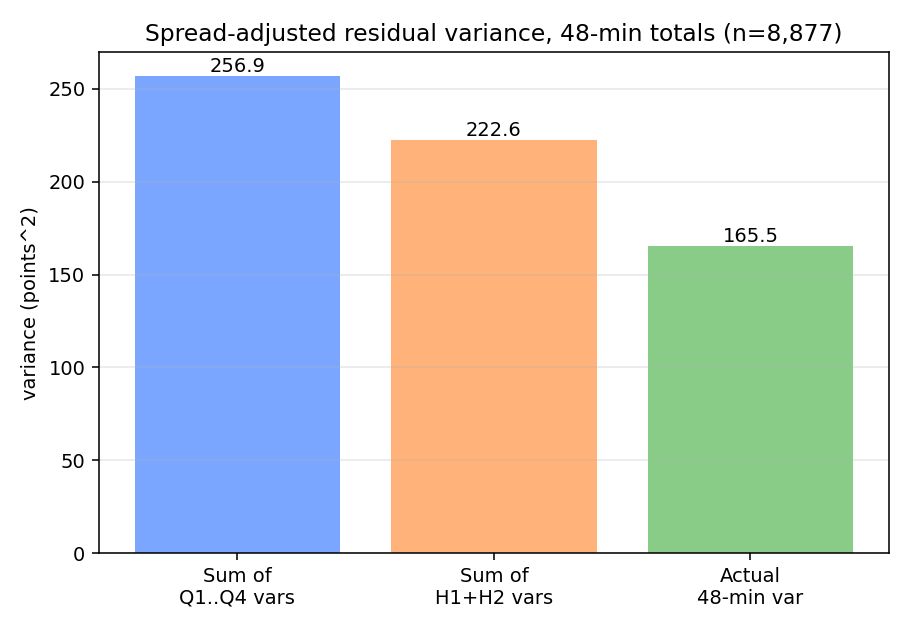
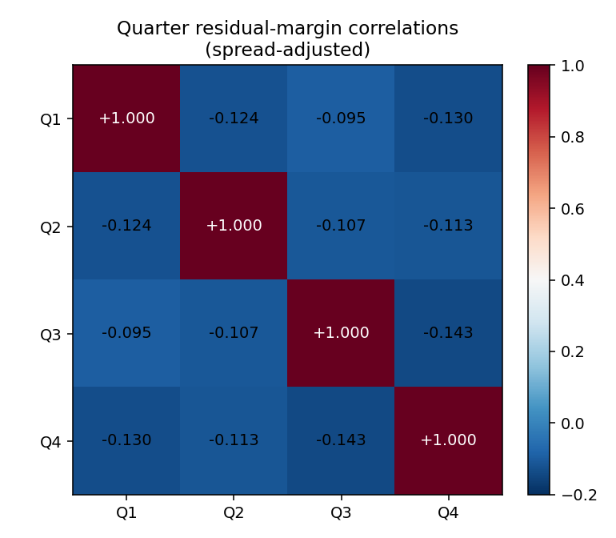
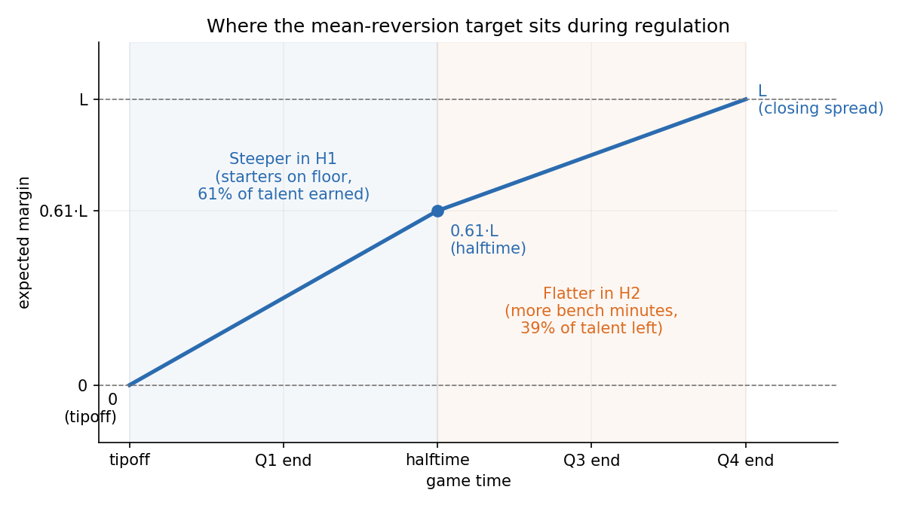

Ever get the sense that comebacks happen way more often in NBA games than they should? That the team up by 15 with five minutes to go in the third quarter can get hacked on every drive without a whistle, while the trailing team picks up free throws on the lightest brush? That the second half of a game you thought was decided somehow turns into a four-point game with three minutes left?

You aren't wrong. NBA games actively pull back on their own scoreboards, and you can see it cleanly in the box score. There are actually two distinct ways this happens, and they're often confused for one another:

1. *Pull toward zero.* Leads shrink. A team up by 15 doesn't usually stay up by 15. The margin reverts toward a tied game.
2. *Pull toward the closing spread.* If the favorite is somehow trailing at halftime, the talent gap reasserts itself in the second half. The margin reverts toward whatever pre-game expectation the betting market had priced in.

These look like opposite forces, but they aren't competing. They're two distinct forces acting on the live margin at the same time, and each intuition catches whichever one is more visible at the moment of the game it describes. This post sets up a test for whether mean reversion exists at all, shows that it does, and walks through the two forces and the model they imply.

## Testing for mean reversion

The whole test relies on one identity from probability. The variance of a sum of random variables is

$$\text{Var}\left(\sum_{i} X_{i}\right) = \sum_{i} \text{Var}(X_{i}) + 2 \sum_{i \lt j} \text{Cov}(X_{i}, X_{j})$$

Every variance term on the right-hand side is non-negative. So the only way the variance of the sum can come out smaller than the sum of the individual variances is if the covariance terms are negative on net. There is no other knob.

A negative covariance between $X_i$ and $X_j$ means that when one is above its expected value, the other tends to be below its expected value. In our context, where each $X_i$ is a quarter of a basketball game, that's exactly the definition of mean reversion: a positive surprise in one quarter predicts a negative surprise in another. So the test is mechanical. Treat each quarter's margin as one of the $X_i$, sum the per-quarter variances, and compare to the actual variance of the game margin. If the actual number is meaningfully smaller, we have negative cross-covariances and the quarters are mean-reverting.

Each row in our dataset is one NBA regular-season game from 2017 to 2023 where ESPN reports a real closing gambling point spread (n = 8,877). From the play-by-play, we take the cumulative home and away scores at the end of each regulation quarter (Q1 through Q4) and difference them to get per-quarter margins. Games that went to overtime are kept but truncated at the end of regulation, where the score is tied by definition, so those games contribute a Q4-end margin of zero. Everything below is therefore a 48-minute analysis; the closing spread $L$ is the market's expectation for the full game (including any OT). The mismatch this introduces is tiny: OT occurs in 5.4% of games and the favorite's expected edge over five extra minutes is about $L \cdot 5/48$, so using full-game $L$ as the regulation target biases the residual by roughly $0.006L$ — about 0.03 points at the average spread. We ignore it.

One subtlety: if we used raw margins, a positive correlation across quarters would creep in by construction, since better teams beat their opponents in every quarter. So we subtract the per-quarter expected margin from each quarter:

$$r_q = (\text{home}_q - \text{away}_q) - \frac{\text{closing spread}}{4}$$

The `/4` baseline is a simplification. A cleaner version splits the spread across quarters by an empirical talent-realization fraction (about 61% in H1, 39% in H2, since starters play more H1 minutes). We use `/4` here because per-quarter dispersion is dominated by random play, not by the spread, so the choice of split barely moves the variance numbers. $r_q$ is the per-quarter surprise: how the quarter went relative to where the market expected it to land. Note that if the closing spread mismeasures the true talent gap, that error is *common* to all four quarters and pushes the cross-quarter covariances positive — so any negative covariance we find is, if anything, understated.

Plug them in. Per-quarter residual standard deviations across the four quarters are about 8.0, 7.9, 8.3, and 7.8 points (the corresponding variances are 64.7, 62.9, 68.9, and 60.4). If those four were independent draws, the standard deviation of their sum would be $\sqrt{64.7 + 62.9 + 68.9 + 60.4} \approx 16.0$ points. The actual standard deviation of the 48-minute residual is 12.9 points. We're missing about three points of dispersion, or about 20% of what independence predicts.

The bar chart shows the comparison in variance units, which is where the math is additive. The gap between the predicted sum-of-quarter bar and the actual-game bar is exactly the (negative of the) sum of all the cross-quarter covariance terms in the formula. The middle bar makes the same point one aggregation level up: the sum of the H1 and H2 variances also overstates the actual 48-minute variance, just by less. The conclusion is the same at both levels. NBA quarters do not behave like independent random draws.

The same identity also pins down a correlation directly. For two pieces, $\text{Var}(H_1 + H_2) = \text{Var}(H_1) + \text{Var}(H_2) + 2 \text{Cov}(H_1, H_2)$, so once you know the three variances in the middle and right bars of the chart, you can back out the cross-covariance, and dividing by the product of the half standard deviations gives a correlation. It comes out to −0.26, with a 95% bootstrap confidence interval of [−0.28, −0.24] (here and throughout, intervals are percentile bootstraps resampling games, 1,000–2,000 resamples). In normalized units, a one-standard-deviation surprise in the first half predicts about 0.26 standard deviations of opposite-sign surprise in the second.

The same trick at the four-quarter level requires the full correlation matrix because there are six pairs to keep track of rather than one:

Every single off-diagonal entry is negative, and every one of the six pairwise confidence intervals excludes zero. The Q3-to-Q4 correlation is the strongest at about −0.14 [−0.16, −0.12], but the pattern is uniform: no quarter predicts a same-signed surprise in any other quarter. They all reach back toward zero.

This isn't the first look at intra-game NBA scoring dynamics. Stern (1994) modeled the score margin as a Brownian motion with drift — exactly the independent-increments baseline our variance test rejects. Gabel & Redner (2012), working from play-by-play, found NBA scoring is well described by an anti-persistent random walk with a weak linear restoring force pulling the margin toward zero, and Clauset, Kogan & Redner (2015) showed lead-change statistics across sports follow random-walk laws. What those models share is a *single* restoring force. The next section is about why one force isn't enough.

## Two forces, one trajectory

There are two distinct forces acting on the live margin during a game, and the −0.26 H1↔H2 correlation is what we get when both are running.

Force 1 is talent realization. The better team's skill edge converts into scoreboard advantage over the 48 minutes of play. We treat the closing spread $L$ as the target for the end-of-regulation margin. This is a deterministic drift: every second of regulation delivers a small fraction of $L$ to the margin, with most of it earned in the first half because that's when the starter minutes are concentrated. Standalone, Force 1 says the margin should land at $L$ by the end of 48 minutes.

Force 2 is mean reversion of deviations. At any moment, the live margin almost certainly isn't sitting exactly where Force 1 says it should be. Random shot variance, in-game runs, foul trouble, and lineup churn knock it off course. Force 2 drags those deviations back. Standalone, applied to a margin sitting above zero, it looks exactly like "leads shrink."

The expected margin trajectory is the running balance of Force 1 alone, because Force 2 acts on departures from the trajectory rather than on the trajectory itself. It walks from zero at tipoff to $L$ at the end of regulation, front-loaded into the first half:

When fans say "leads always shrink" they're noticing Force 2 dragging an over-extended live margin back toward the trajectory. When they say "the better team eventually shows up" they're noticing Force 1 marching the trajectory itself out toward $L$ by the end of regulation. Two real forces, both always present, each more visible at a different time in the game.

To check whether this two-forces picture actually fits the data, we can run a regression. Snapshot the live margin $S_t$ at the end of each of the first three quarters and fit the final regulation margin on it and on the closing spread:

$$S_T = \beta_L \cdot L + \beta_S \cdot S_t + \epsilon$$

The two-forces picture makes specific predictions about these coefficients. β_S should be â(t) = exp(−κ(T − t)), Force 2's decay of any residual over the remaining time. β_L should be 1 − â(t)·f(t): Force 1 has already delivered f(t)·L into S_t by time t, and that piece is forecast to persist with factor â(t), so only the remaining 1 − â(t)·f(t) of L still needs to be picked up directly. A textbook single-κ Ornstein-Uhlenbeck pulling toward L·f(t) predicts a much smaller β_L, because that model has the same κ controlling both the talent-realization rate and the deviation-decay rate, so making deviations decay fast also slows down the talent delivery. Fitting on 8,871 games with a real closing line and known tip winner (brackets are 95% bootstrap CIs):

| Snapshot | empirical β_S | empirical β_L | two-force β_L | single-κ OU β_L |
|---|---:|---:|---:|---:|
| End Q1   | 0.60 [0.49, 0.68] | 0.77 [0.73, 0.83] | 0.82 | 0.25 |
| Halftime | 0.75 [0.73, 0.77] | 0.53 [0.50, 0.57] | 0.54 | 0.21 |
| End Q3   | 0.84 [0.83, 0.86] | 0.26 [0.23, 0.28] | 0.32 | 0.12 |

β_S behaves the same way under both models because both share the same form for the residual decay. The split is on β_L. The single-κ OU under-predicts the spread's role in the final margin by a factor of two to three at every snapshot, far outside every confidence interval. The two-force prediction sits inside the CI at the first two snapshots and misses modestly at end-Q3 (0.32 predicted vs. an interval topping out at 0.28) — not a perfect fit, but a factor of 2.5 closer than the single-rate model at its worst point. The data wants Force 1 and Force 2 to have independent rates.

The two-force model corresponds to a stochastic differential equation of the form

$$dS_t = L f'(t) dt - \kappa (S_t - L \cdot f(t)) dt + \sigma dW_t$$

where $f'(t)$ is the instantaneous talent-realization rate, the slope of the trajectory chart. The first term is Force 1: a deterministic drift that delivers $L$ to the margin over the 48 minutes on the talent path's schedule, independent of $\kappa$. The second term is Force 2: an Ornstein-Uhlenbeck pull on the deviation $r_t = S_t - L \cdot f(t)$ back toward zero at rate $\kappa$. Negative cross-period correlation falls right out: when the margin overshoots the trajectory in one stretch, Force 2 pulls it back in the next.

Two more checks the model passes. First, an OU residual sampled on any time grid is an AR(1), so the κ implied by a fit should not depend on which window you fit it over. Fitting every ordered pair of quarter-end snapshots separately, the implied κ stays in a tight band (half-life of a deviation ≈ 50–57 minutes, jointly fit at 52). Quarters and halves were never structural — they're just where the box score makes sampling cheap. Second, the OU pull term predicts the give-back should be *linear* in the size of the deviation, and it is: splitting games into terciles by how far the halftime margin sits from the expected path, the regression slope of the H2 residual on the H1 residual is flat across them — about −0.29, −0.27, −0.25. The second half claws back roughly a quarter of the halftime deviation whether that deviation is 2 points or 15. (The raw correlation looks like it strengthens across those buckets, −0.08 to −0.37, but that's range-restriction attenuation — small-deviation buckets have less signal in the X variable — not a stronger pull.)

## A quirk written into the rulebook

One contributor to quarter-level structure isn't emergent at all — it's written directly into the rulebook: who gets the opening possession of each quarter. The team that wins the opening tip gets the first possession of Q1 and (by the inbounds-alternation rule) Q4. The team that loses the tip gets the first possession of Q2 and Q3. Estimated as a regressor in the snapshot regressions above, one net opening possession is worth about 0.30–0.35 points of expected margin. So the expected per-quarter lean to the tip winner runs roughly `(+0.35, −0.35, −0.35, +0.35)` across Q1 through Q4, and the conditional expected margin swings by about 0.7 points from Q1 to Q2 and again from Q3 to Q4, the moment the tip is decided. It cancels over each half and over the full game, which is why it doesn't show up in the half-level variance test. Is it tradeable? A 0.35-point shift on a quarter margin with σ ≈ 8 moves an at-the-money quarter-winner contract by Φ(0.35/8) − Φ(0) ≈ 1.7 cents — almost exactly the size of a typical exchange taker fee at even prices (Kalshi's 0.07·p·(1−p) is 1.75 cents at p = 0.50). The rulebook hands you an edge approximately the size of the fee: real, thin, and probably maker-only.

## Why? Hypotheses for another day

Knowing the shape of mean reversion isn't the same as knowing what drives it, and the obvious analysis for the "what" is a trap. Sorting games by second-half behavior — how much the starters played after halftime, say — produces dramatic correlation gradients (near zero in one tail, −0.55 in the other). They're almost entirely an artifact: the sort variable is caused by the score path, so "competitive game where the starters stayed in" is close to a synonym for "game where H2 offset H1." We ran the identical sorts on synthetic games with independent halves, where any bucket structure is selection by construction, and the synthetic gradients matched the real ones. Those sorts identify nothing, so we make no mechanism claims here.

What we have instead are hypotheses, each with a toehold in the data, none established:

- *Rotation and fatigue.* Games where both teams ride their starters in the first half revert modestly harder in the second (a halftime-observable association, so not a selection artifact — but an association).
- *Foul-trouble minute redistribution.* A star picks up two fouls in Q2, sits, returns clean in H2. First-half foul counts predict slightly stronger reversion while non-discretionary whistles (out-of-bounds, traveling) predict nothing, which is at least the right fingerprint.
- *Motivation.* Berger & Pope (2011) found teams trailing by one at halftime win more often than teams leading by one — a sharper, discontinuous flavor of self-regulation.
- *End-game behavior.* Clock-milking and intentional fouling compress margins late, which should make the pull nonlinear in the deviation — though the flat give-back slope above says any such nonlinearity is second-order over the bulk of games.

Distinguishing these properly needs within-game, chunk-level estimates of the reversion rate as a function of who's on the floor — with the score path controlled as a regressor rather than lurking in the sort. That's a different post.

## Takeaway

For anyone modeling NBA scoring, the practical takeaway is that you can't treat halves or quarters as independent draws and just add them up. Independence predicts a 48-minute margin standard deviation of about 16 points; the actual value is about 13. The implied H1↔H2 correlation for an unconditional NBA game is −0.26 [−0.28, −0.24], the second half returns about 25% of whatever deviation the first half built up regardless of its size, and a single restoring force can't fit the data — talent realization and deviation decay run at independent rates. The broadcaster cliché about the game tightening up at the end turns out to be a real, measurable property of the sport — just one you should claim no more precisely than the data allows.

## Older work on the same question

- Stern (1994), [A Brownian Motion Model for the Progress of Sports Scores](https://www.tandfonline.com/doi/abs/10.1080/01621459.1994.10476851) — the canonical independent-increments model of the live margin; the baseline our variance test rejects.
- Gabel & Redner (2012), [Random Walk Picture of Basketball Scoring](https://arxiv.org/abs/1109.2825) — found NBA scoring is an anti-persistent random walk with a weak restoring force toward zero; the closest prior to our Force 2, but with a single rate.
- Clauset, Kogan & Redner (2015), [Safe leads and lead changes in competitive team sports](https://journals.aps.org/pre/abstract/10.1103/PhysRevE.91.062815) — lead-change statistics follow random-walk laws across sports, NBA included.
- Berger & Pope (2011), [Can Losing Lead to Winning?](https://pubsonline.informs.org/doi/10.1287/mnsc.1110.1328) — teams trailing by one at halftime win more than teams leading by one; the motivational flavor of self-regulation.
